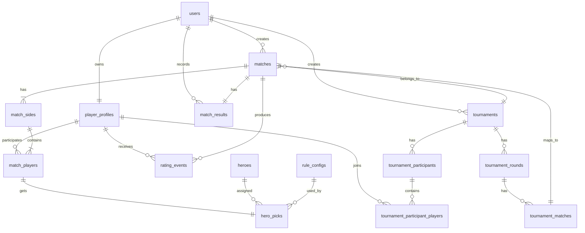

# Technical Design: Unmatched Admin Panel

## 1. Назначение документа

Этот документ фиксирует технический дизайн первой версии приложения для организации офлайн-матчей по Unmatched.

Документ покрывает:

- границы `MVP`
- архитектурный подход
- доменную модель
- структуру таблиц БД
- `ERD`
- API первой версии
- экраны и основные пользовательские действия
- правила авторизации
- стартовую логику автоподбора персонажей
- нефункциональные требования и риски

## 2. Границы первой версии

### Входит в `MVP`

- матчи `1v1`
- матчи `2v2`
- турниры `1v1`
- турниры `2v2`
- общий рейтинг игроков
- автоматический подбор персонажей
- авторизация пользователей
- история матчей
- история изменения рейтинга
- базовая статистика игроков и персонажей

### Не входит в `MVP`

- цифровая реализация игрового поля
- ходы, колоды, карты и эффекты карт
- симуляция партии
- `FFA` режимы на 3-4 игроков
- обязательные баны персонажей
- сезонный рейтинг

## 3. Основные продуктовые правила

- Рейтинг общий и непрерывный.
- Подбор персонажей выполняется автоматически.
- Персонажи имеют `tier` и числовой `power_score`.
- Чем выше рейтинг более сильного игрока или команды, тем более слабый пул персонажей должен быть им доступен.
- Матчи создаются и администрируются внутри панели.
- Авторизация обязательна.
- В первой версии доступны только роли `admin` и `player`.
- Баны персонажей не реализуются в `MVP`, но модель данных не должна блокировать их добавление позже.

## 4. Предлагаемый стек

- `Next.js`
- `TypeScript`
- `SQLite` на старте разработки
- `Prisma`
- `NextAuth` или эквивалентный серверный auth-слой
- `Zod` для валидации входных данных

Переход на `PostgreSQL` можно сделать позже, когда появятся:

- несколько окружений
- реальная многопользовательская нагрузка
- потребность в более строгой работе с `JSON` и миграциями

## 5. Архитектурный подход

Приложение строится как один репозиторий с единым frontend и backend-слоем.

Для `MVP` отдельный backend-сервис не нужен. `Next.js` закрывает:

- UI
- серверные обработчики
- auth-слой
- интеграцию с Prisma
- бизнес-операции над матчами, рейтингом и турнирами

### Логические слои

- `app` или `pages`: UI, роутинг, server actions или route handlers
- `modules/auth`: аутентификация, сессии, роли, guards
- `modules/players`: игроки, профили, статистика
- `modules/heroes`: персонажи и их сила
- `modules/matches`: матчи, составы, результаты
- `modules/rating`: расчет `Elo` и журнал изменений
- `modules/tournaments`: сетки, раунды, связка с матчами
- `modules/rules`: конфиги автоподбора персонажей
- `shared/db`: Prisma schema и клиент
- `shared/lib`: общие утилиты и типы

### Ключевой принцип

Турнирные матчи не должны иметь отдельную бизнес-логику результата. Турнир должен ссылаться на обычные матчи, чтобы:

- рейтинг обновлялся единообразно
- история матчей была общей
- логика завершения матча не дублировалась

## 6. Доменная модель

### Список сущностей

- `User`
- `PlayerProfile`
- `Hero`
- `Match`
- `MatchSide`
- `MatchPlayer`
- `HeroPick`
- `MatchResult`
- `RatingEvent`
- `Tournament`
- `TournamentParticipant`
- `TournamentRound`
- `TournamentMatch`
- `RuleConfig`

### Общее описание

`User` отвечает за доступ в систему. `PlayerProfile` хранит игровой рейтинг и статистику. `Match` описывает матч как контейнер. `MatchSide` позволяет одинаково представить игрока в `1v1` и команду в `2v2`. `MatchPlayer` связывает игроков со сторонами матча. `HeroPick` хранит выданного персонажа. `MatchResult` отделен от карточки матча для явной фиксации итога и аудита. `RatingEvent` хранит изменение рейтинга по каждому игроку. `Tournament*` сущности покрывают турнирную сетку. `RuleConfig` хранит правила автоподбора.

## 7. Схема таблиц БД

Ниже приведен рекомендуемый стартовый набор таблиц и ключевых полей.

### 7.1 `users`

| Поле | Тип | Ограничения | Назначение |
| --- | --- | --- | --- |
| `id` | uuid | pk | Идентификатор пользователя |
| `email` | text | unique, not null | Логин |
| `password_hash` | text | not null | Хэш пароля |
| `role` | text | not null | `admin` или `player` |
| `is_active` | boolean | not null, default true | Активность учетной записи |
| `created_at` | timestamptz | not null | Дата создания |
| `updated_at` | timestamptz | not null | Дата обновления |

### 7.2 `player_profiles`

| Поле | Тип | Ограничения | Назначение |
| --- | --- | --- | --- |
| `id` | uuid | pk | Идентификатор профиля |
| `user_id` | uuid | fk -> users.id, unique | Связь с учетной записью |
| `display_name` | text | not null | Отображаемое имя |
| `rating` | integer | not null, default 1000 | Текущий рейтинг |
| `wins` | integer | not null, default 0 | Победы |
| `losses` | integer | not null, default 0 | Поражения |
| `draws` | integer | not null, default 0 | Ничьи, если понадобятся позже |
| `matches_played` | integer | not null, default 0 | Количество матчей |
| `created_at` | timestamptz | not null | Дата создания |
| `updated_at` | timestamptz | not null | Дата обновления |

### 7.3 `heroes`

| Поле | Тип | Ограничения | Назначение |
| --- | --- | --- | --- |
| `id` | uuid | pk | Идентификатор персонажа |
| `slug` | text | unique, not null | Стабильный код |
| `name` | text | not null | Имя персонажа |
| `tier` | text | not null | `S`, `A`, `B`, `C`, `D` |
| `power_score` | integer | not null | Числовая сила |
| `is_active` | boolean | not null, default true | Доступность персонажа |
| `metadata` | jsonb | not null, default '{}' | Место под будущие флаги |
| `created_at` | timestamptz | not null | Дата создания |
| `updated_at` | timestamptz | not null | Дата обновления |

### 7.4 `matches`

| Поле | Тип | Ограничения | Назначение |
| --- | --- | --- | --- |
| `id` | uuid | pk | Идентификатор матча |
| `mode` | text | not null | `1v1` или `2v2` |
| `status` | text | not null | `draft`, `ready`, `finished`, `rated`, `cancelled` |
| `created_by_user_id` | uuid | fk -> users.id | Кто создал матч |
| `started_at` | timestamptz | null | Фактический старт |
| `finished_at` | timestamptz | null | Фактическое завершение |
| `tournament_id` | uuid | fk -> tournaments.id, null | Опциональная связь с турниром |
| `notes` | text | null | Заметки |
| `created_at` | timestamptz | not null | Дата создания |
| `updated_at` | timestamptz | not null | Дата обновления |

### 7.5 `match_sides`

| Поле | Тип | Ограничения | Назначение |
| --- | --- | --- | --- |
| `id` | uuid | pk | Идентификатор стороны |
| `match_id` | uuid | fk -> matches.id | Матч |
| `side_index` | integer | not null | `1` или `2` |
| `name` | text | null | Имя стороны или команды |
| `seed_rating` | integer | not null | Рейтинг стороны до старта |
| `is_winner` | boolean | not null, default false | Победитель |
| `created_at` | timestamptz | not null | Дата создания |

Уникальный индекс:

- `unique(match_id, side_index)`

### 7.6 `match_players`

| Поле | Тип | Ограничения | Назначение |
| --- | --- | --- | --- |
| `id` | uuid | pk | Идентификатор участия |
| `match_side_id` | uuid | fk -> match_sides.id | Сторона матча |
| `player_profile_id` | uuid | fk -> player_profiles.id | Игрок |
| `slot_index` | integer | not null | Позиция внутри стороны |
| `rating_before` | integer | not null | Рейтинг до матча |
| `rating_after` | integer | null | Рейтинг после матча |
| `rating_delta` | integer | null | Изменение рейтинга |
| `created_at` | timestamptz | not null | Дата создания |

Уникальные индексы:

- `unique(match_side_id, slot_index)`
- `unique(match_side_id, player_profile_id)`

### 7.7 `hero_picks`

| Поле | Тип | Ограничения | Назначение |
| --- | --- | --- | --- |
| `id` | uuid | pk | Идентификатор выбора |
| `match_player_id` | uuid | fk -> match_players.id, unique | Игрок в матче |
| `hero_id` | uuid | fk -> heroes.id | Назначенный персонаж |
| `assigned_by_rule_config_id` | uuid | fk -> rule_configs.id, null | Какое правило применилось |
| `assignment_source` | text | not null | `auto`, позже можно добавить `manual` |
| `created_at` | timestamptz | not null | Дата создания |

### 7.8 `match_results`

| Поле | Тип | Ограничения | Назначение |
| --- | --- | --- | --- |
| `id` | uuid | pk | Идентификатор результата |
| `match_id` | uuid | fk -> matches.id, unique | Матч |
| `winning_side_id` | uuid | fk -> match_sides.id | Победившая сторона |
| `recorded_by_user_id` | uuid | fk -> users.id | Кто внес результат |
| `recorded_at` | timestamptz | not null | Время фиксации |
| `payload` | jsonb | not null, default '{}' | Дополнительные данные |

### 7.9 `rating_events`

| Поле | Тип | Ограничения | Назначение |
| --- | --- | --- | --- |
| `id` | uuid | pk | Идентификатор события |
| `player_profile_id` | uuid | fk -> player_profiles.id | Игрок |
| `match_id` | uuid | fk -> matches.id | Матч |
| `rating_before` | integer | not null | Рейтинг до пересчета |
| `rating_after` | integer | not null | Рейтинг после пересчета |
| `delta` | integer | not null | Изменение рейтинга |
| `k_factor` | integer | not null | Использованный `K` |
| `created_at` | timestamptz | not null | Время записи |

### 7.10 `tournaments`

| Поле | Тип | Ограничения | Назначение |
| --- | --- | --- | --- |
| `id` | uuid | pk | Идентификатор турнира |
| `name` | text | not null | Название |
| `mode` | text | not null | `1v1` или `2v2` |
| `format` | text | not null | `single_elimination` |
| `status` | text | not null | `draft`, `active`, `finished`, `cancelled` |
| `created_by_user_id` | uuid | fk -> users.id | Создатель |
| `started_at` | timestamptz | null | Старт |
| `finished_at` | timestamptz | null | Завершение |
| `created_at` | timestamptz | not null | Дата создания |
| `updated_at` | timestamptz | not null | Дата обновления |

### 7.11 `tournament_participants`

| Поле | Тип | Ограничения | Назначение |
| --- | --- | --- | --- |
| `id` | uuid | pk | Идентификатор участника турнира |
| `tournament_id` | uuid | fk -> tournaments.id | Турнир |
| `participant_type` | text | not null | `player` или `team` |
| `seed` | integer | not null | Позиция посева |
| `display_name` | text | not null | Отображаемое имя |
| `seed_rating` | integer | not null | Рейтинг на момент посева |
| `created_at` | timestamptz | not null | Дата создания |

### 7.12 `tournament_participant_players`

Эта таблица нужна, чтобы аккуратно представить команду в `2v2`.

| Поле | Тип | Ограничения | Назначение |
| --- | --- | --- | --- |
| `id` | uuid | pk | Идентификатор записи |
| `tournament_participant_id` | uuid | fk -> tournament_participants.id | Участник турнира |
| `player_profile_id` | uuid | fk -> player_profiles.id | Игрок |
| `slot_index` | integer | not null | Позиция внутри участника |

### 7.13 `tournament_rounds`

| Поле | Тип | Ограничения | Назначение |
| --- | --- | --- | --- |
| `id` | uuid | pk | Идентификатор раунда |
| `tournament_id` | uuid | fk -> tournaments.id | Турнир |
| `round_index` | integer | not null | Номер раунда |
| `name` | text | not null | Например `Quarterfinal` |
| `created_at` | timestamptz | not null | Дата создания |

### 7.14 `tournament_matches`

| Поле | Тип | Ограничения | Назначение |
| --- | --- | --- | --- |
| `id` | uuid | pk | Идентификатор связи |
| `tournament_round_id` | uuid | fk -> tournament_rounds.id | Раунд |
| `match_id` | uuid | fk -> matches.id, unique | Обычный матч системы |
| `bracket_position` | integer | not null | Позиция в сетке |
| `source_left_participant_id` | uuid | fk -> tournament_participants.id, null | Левый слот |
| `source_right_participant_id` | uuid | fk -> tournament_participants.id, null | Правый слот |
| `winner_participant_id` | uuid | fk -> tournament_participants.id, null | Победитель слота |

### 7.15 `rule_configs`

| Поле | Тип | Ограничения | Назначение |
| --- | --- | --- | --- |
| `id` | uuid | pk | Идентификатор правила |
| `mode` | text | not null | `1v1` или `2v2` |
| `rating_diff_min` | integer | not null | Нижняя граница |
| `rating_diff_max` | integer | not null | Верхняя граница |
| `stronger_min_power` | integer | not null | Нижняя граница силы для сильной стороны |
| `stronger_max_power` | integer | not null | Верхняя граница силы для сильной стороны |
| `weaker_min_power` | integer | not null | Нижняя граница силы для слабой стороны |
| `weaker_max_power` | integer | not null | Верхняя граница силы для слабой стороны |
| `is_active` | boolean | not null, default true | Активность |
| `priority` | integer | not null, default 0 | Разрешение конфликтов |
| `created_at` | timestamptz | not null | Дата создания |
| `updated_at` | timestamptz | not null | Дата обновления |

Ограничения:

- интервалы правил для одного режима не должны хаотично пересекаться
- на один диапазон должен приходиться один приоритетный активный rule

## 8. ERD

## 9. Правила рейтинга

### 9.1 Базовый подход

В первой версии используется `Elo`.

Базовые параметры:

- стартовый рейтинг игрока: `1000`
- базовый `K-factor`: `32`

### 9.2 `1v1`

Стандартная формула:

- `expected = 1 / (1 + 10 ^ ((opponent - player) / 400))`
- `new_rating = old_rating + K * (actual - expected)`

### 9.3 `2v2`

Для каждой стороны рассчитывается `team_rating` как среднее значение рейтингов двух игроков.

Дальше:

- рассчитывается ожидаемый результат стороны по `team_rating`
- вычисляется общий `delta` стороны
- каждому игроку в стороне записывается одинаковый базовый `delta`

Для первой версии этого достаточно. Позже можно добавить взвешивание по индивидуальному рейтингу игрока.

### 9.4 Инварианты рейтинга

- отмененный матч не влияет на рейтинг
- рейтинг не должен пересчитываться дважды для одного и того же матча
- после расчета создаются `rating_events` для каждого игрока
- состояние матча переходит в `rated` только после успешной фиксации всех событий рейтинга

## 10. Правила автоматического подбора персонажей

### 10.1 Общий принцип

Система работает по разнице рейтинга между двумя сторонами.

Алгоритм:

1. Определить рейтинг каждой стороны.
2. Найти более сильную и более слабую сторону.
3. Вычислить `rating_diff = abs(side_a_rating - side_b_rating)`.
4. Найти в `rule_configs` активное правило по режиму и диапазону `rating_diff`.
5. Для сильной стороны выбрать персонажей в диапазоне `stronger_min_power..stronger_max_power`.
6. Для слабой стороны выбрать персонажей в диапазоне `weaker_min_power..weaker_max_power`.
7. Из отфильтрованных активных персонажей назначить персонажа автоматически.

### 10.2 Назначение персонажа

Вариант первой версии:

- система получает допустимый пул персонажей
- случайно выбирает персонажа из допустимого пула
- записывает `assigned_by_rule_config_id`
- фиксирует `assignment_source = auto`

Более безопасная альтернатива:

- назначать не случайного персонажа, а персонажа с минимальным числом использований за последний период

Для `MVP` я бы заложил интерфейс стратегии выбора, но в реализацию первой версии включил простое случайное назначение из допустимого пула.

### 10.3 Черновая таблица правил

Ниже пример стартовой конфигурации, которую потом придется калибровать по реальным матчам.

#### Для режима `1v1`

| Разница рейтинга | Сильная сторона | Слабая сторона |
| --- | --- | --- |
| `0-99` | `power_score 1-100` | `power_score 1-100` |
| `100-249` | `power_score 1-75` | `power_score 1-100` |
| `250-399` | `power_score 1-60` | `power_score 20-100` |
| `400+` | `power_score 1-45` | `power_score 35-100` |

#### Для режима `2v2`

| Разница рейтинга | Сильная сторона | Слабая сторона |
| --- | --- | --- |
| `0-149` | `power_score 1-100` | `power_score 1-100` |
| `150-299` | `power_score 1-80` | `power_score 1-100` |
| `300-499` | `power_score 1-65` | `power_score 15-100` |
| `500+` | `power_score 1-50` | `power_score 30-100` |

### 10.4 Инварианты автоподбора

- в подбор попадают только `is_active = true` персонажи
- если правило найдено, но пул пустой, матч нельзя переводить в `ready`
- если подходящее правило не найдено, система должна вернуть понятную ошибку конфигурации
- для каждого `match_player` должен существовать ровно один `hero_pick`

### 10.5 Будущая расширяемость

Чтобы позже добавить баны, достаточно:

- завести таблицу `match_bans`
- добавить шаг применения ban rules до финального auto-assign
- сузить допустимый пул до выбора персонажа

## 11. Состояния и бизнес-переходы

### 11.1 Матч

Переходы:

- `draft -> ready`
- `ready -> finished`
- `finished -> rated`
- `draft -> cancelled`
- `ready -> cancelled`

Правила:

- в `draft` можно менять состав и конфигурацию
- в `ready` должны быть заполнены обе стороны и все персонажи
- в `finished` результат зафиксирован, но рейтинг еще не обновлен
- в `rated` результат и рейтинг полностью зафиксированы

### 11.2 Турнир

Переходы:

- `draft -> active`
- `active -> finished`
- `draft -> cancelled`
- `active -> cancelled`

## 12. API первой версии

Ниже приведен рекомендуемый REST-слой. Если проект пойдет через server actions, эти контракты все равно полезно сохранить как логические use cases.

### 12.1 Auth

- `POST /api/auth/register`
- `POST /api/auth/login`
- `POST /api/auth/logout`
- `GET /api/auth/me`

### 12.2 Players

- `GET /api/players`
- `GET /api/players/:id`
- `POST /api/players`
- `PATCH /api/players/:id`
- `GET /api/players/:id/matches`
- `GET /api/players/:id/rating-events`

### 12.3 Heroes

- `GET /api/heroes`
- `GET /api/heroes/:id`
- `POST /api/heroes`
- `PATCH /api/heroes/:id`
- `POST /api/heroes/:id/archive`
- `POST /api/heroes/:id/restore`

### 12.4 Rule Configs

- `GET /api/rule-configs`
- `POST /api/rule-configs`
- `PATCH /api/rule-configs/:id`
- `POST /api/rule-configs/:id/activate`
- `POST /api/rule-configs/:id/deactivate`

### 12.5 Matches

- `GET /api/matches`
- `GET /api/matches/:id`
- `POST /api/matches`
- `PATCH /api/matches/:id`
- `POST /api/matches/:id/assign-heroes`
- `POST /api/matches/:id/mark-ready`
- `POST /api/matches/:id/record-result`
- `POST /api/matches/:id/cancel`

### 12.6 Tournaments

- `GET /api/tournaments`
- `GET /api/tournaments/:id`
- `POST /api/tournaments`
- `PATCH /api/tournaments/:id`
- `POST /api/tournaments/:id/participants`
- `POST /api/tournaments/:id/generate-bracket`
- `POST /api/tournaments/:id/start`
- `POST /api/tournaments/:id/finish`

### 12.7 Leaderboard and Stats

- `GET /api/leaderboard`
- `GET /api/stats/players`
- `GET /api/stats/heroes`
- `GET /api/history/matches`

## 13. Контракты ключевых операций

### 13.1 Создание матча

Вход:

- `mode`
- список сторон
- игроки по сторонам

Валидация:

- для `1v1` у каждой стороны ровно один игрок
- для `2v2` у каждой стороны ровно два игрока
- один и тот же игрок не может быть одновременно в обеих сторонах одного матча

### 13.2 Автоматическое назначение персонажей

Вход:

- `match_id`

Валидация:

- матч не должен быть `cancelled` или `rated`
- состав сторон должен быть полным
- должен существовать активный `RuleConfig`
- должен быть найден непустой пул персонажей

Выход:

- `hero_pick` для каждого `match_player`
- ссылка на примененное правило

### 13.3 Фиксация результата

Вход:

- `match_id`
- `winning_side_id`

Валидация:

- матч должен быть в статусе `ready`
- победитель должен принадлежать матчу
- результат должен быть еще не записан

Побочные эффекты:

- создается `match_result`
- обновляется `matches.status = finished`
- рассчитываются и записываются `rating_events`
- обновляются `player_profiles.rating`
- обновляется `matches.status = rated`

## 14. Экранная структура

### 14.1 `/login`

Действия:

- вход по email и паролю

### 14.2 `/register`

Действия:

- регистрация пользователя
- создание связанного `player_profile`

### 14.3 `/dashboard`

Блоки:

- топ игроков
- последние матчи
- активные турниры
- краткая статистика персонажей

### 14.4 `/players`

Действия:

- список игроков
- поиск
- переход в карточку
- создание игрока админом

### 14.5 `/players/:id`

Блоки:

- профиль
- текущий рейтинг
- история матчей
- история рейтинга
- основные статистики

### 14.6 `/heroes`

Действия:

- список персонажей
- фильтрация по tier
- фильтрация по активности
- создание и редактирование

### 14.7 `/heroes/:id`

Блоки:

- данные персонажа
- `tier`
- `power_score`
- статистика использования

### 14.8 `/matches/new`

Действия:

- выбрать режим
- заполнить состав сторон
- сохранить матч в `draft`

### 14.9 `/matches/:id`

Блоки:

- состав сторон
- назначенные персонажи
- примененное правило подбора
- статус матча
- форма фиксации результата

Действия:

- автоподбор персонажей
- перевод в `ready`
- фиксация результата
- отмена матча

### 14.10 `/tournaments`

Действия:

- список турниров
- создание турнира

### 14.11 `/tournaments/:id`

Блоки:

- карточка турнира
- участники
- сетка
- связанные матчи

Действия:

- добавить участников
- сгенерировать сетку
- запустить турнир
- завершить турнир

### 14.12 `/leaderboard`

Блоки:

- общий рейтинг
- динамика мест

### 14.13 `/history/matches`

Блоки:

- список завершенных матчей
- фильтры по режиму, игроку, турниру

### 14.14 `/settings/rules`

Действия:

- список правил
- редактирование диапазонов
- включение и выключение правил

## 15. Авторизация и доступ

### Роль `admin`

Может:

- управлять игроками
- управлять персонажами
- управлять матчами
- фиксировать результаты
- управлять турнирами
- управлять rule configs

### Роль `player`

Может:

- входить в систему
- смотреть свой профиль
- смотреть рейтинг
- смотреть историю матчей
- смотреть турниры и собственную статистику

Не может:

- менять конфиги
- создавать или редактировать турнир
- фиксировать чужие результаты

## 16. Нефункциональные требования

- Все критические операции должны выполняться в транзакции БД.
- Повторный запрос на фиксацию результата не должен создавать дубль рейтинговых событий.
- Все write-операции должны валидироваться на сервере.
- Должен быть журнал для диагностирования ошибок автоподбора.
- Основные доменные сервисы должны быть покрыты unit-тестами.

## 17. Порядок реализации

### Фаза 1

- auth
- users
- player profiles
- heroes

### Фаза 2

- rule configs
- сервис автоподбора персонажей
- матчи `1v1`
- рейтинг `Elo`

### Фаза 3

- матчи `2v2`
- адаптация рейтинга для команд

### Фаза 4

- турниры
- сетка
- статистика и leaderboard

## 18. Основные риски

- Неправильно подобранные диапазоны `power_score` быстро сделают матчи нечестными.
- Если не зафиксировать строгие инварианты `match -> result -> rating`, рейтинг будет ломаться при повторных сабмитах.
- Если не держать `2v2` через `match_sides`, возникнет дублирование модели.
- Если auth и роли будут внедрены поздно, придется переделывать API и UI-потоки.

## 19. Следующий документ

После этого документа логично подготовить:

- черновой `Prisma schema`
- список initial seed данных по персонажам
- набор use-case тестов для `rating` и `hero assignment`
